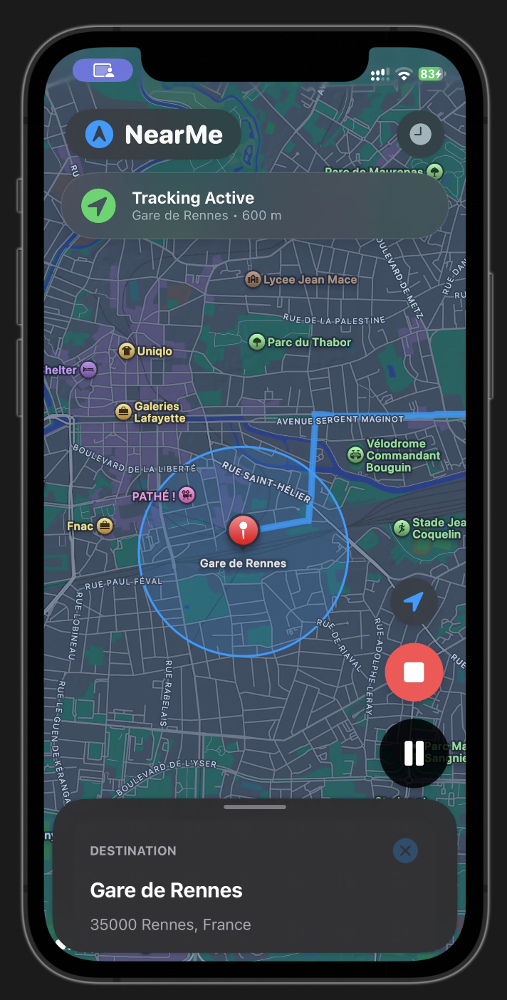

  
  <h1>NearMe</h1>
  
<strong>A beautifully intuitive location-tracking experience. Built entirely native for iOS.</strong>

 

NearMe rethinks how you interact with your surroundings. Set a destination, define your tracking radius, and let iOS seamlessly track your progress—even in the background. Built with the latest SwiftUI frameworks, it feels instantly familiar, effortlessly fast, and perfectly at home on your iPhone.

## ✨ Features

- **Fluid Map Interface:** Integrated tightly with `MapKit` in iOS 17. Fluid animations, contextual tracking controls, and dynamically adapting overlays ensure the map is always the center of your experience.
- **Background Geofencing:** Leveraging Apple's cutting-edge `CLMonitor`, NearMe tracks your distance to your destination in the background with near-zero battery drain. 
- **Arrival Celebrations:** Reaching your destination triggers a beautiful full-screen arrival animation, providing a satisfying and undeniable visual confirmation.
- **Intelligent Search:** Start typing, and iOS finds the most relevant Points of Interest instantly. The custom search bar is pinned cleanly to the top of the interaction sheet, completely decoupled from scrolling gestures.
- **SwiftData History:** Your past destinations are instantly saved and queried via `SwiftData`—Apple's newest and most powerful local database. Fully optimized and ready for seamless CloudKit sync.

## 🛠 Technology Stack

- **Frameworks:** SwiftUI, MapKit, CoreLocation, SwiftData
- **Architecture:** Clean, reactive architecture using `@StateObject` and `@Environment(\.modelContext)`.
- **Target:** iOS 17.0+

## 🚀 Getting Started

1. Open `NearMe.xcodeproj` in Xcode 15 or later.
2. Select an iPhone Simulator or connect your physical device.
3. Hit **Run** (Cmd + R). 
*(Note: Location permissions will be requested on first launch).*

 

  
Designed with ❤️ for iOS.

